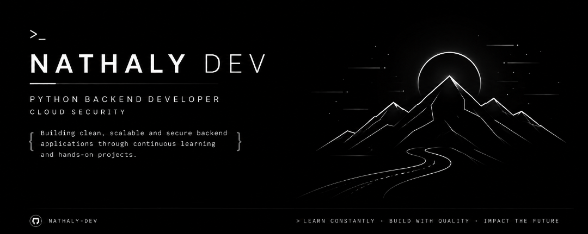

<p align="center">
  
</p>

<h1 align="center">Hi, I'm Nathaly 👋</h1>

<p align="center">
  <strong>Python Backend Developer in Training • Cloud Security</strong>
</p>

<p align="center">
Building clean, scalable and secure backend applications through continuous learning and hands-on projects.
</p>

<p align="center">
  <a href="https://www.linkedin.com/in/nathaly-vitoria-dev/" target="_blank">
    
  </a>
  <a href="mailto:nathalydc2023@gmail.com">
    
  </a>
</p>

---

# 👩🏻‍💻 About Me

```python
class Nathaly:

    role = "Python Backend Developer in Training"

    focus = [
        "Python",
        "Backend Development",
        "Cloud Security"
    ]

    learning = "Build → Practice → Improve"

    goal = "Become a Backend Developer specialized in Cloud Security"
```

---

# 🚀 Tech Stack

<p align="center">


</p>

---

# 📖 Learning Roadmap

```text
✅ Git & GitHub

🔄 Python Fundamentals

⬜ FastAPI
⬜ REST APIs
⬜ SQL
⬜ PostgreSQL
⬜ Docker
⬜ Linux
⬜ AWS
⬜ Cloud Security
```

---

# 📂 Featured Projects

| Project                 | Description                                               |
| ----------------------- | --------------------------------------------------------- |
| 🍽️ **Menu Go**          | Restaurant management system built while learning Python. |
| 📖 **Learning Journal** | Technical notes and learning documentation.               |

---

# 📊 GitHub Analytics

<p align="center">


</p>

<p align="center">


</p>

---

# 🎯 2026 Goals

- Build production-ready backend applications
- Master FastAPI
- Design REST APIs
- Learn Docker and Linux
- Study AWS fundamentals
- Develop Cloud Security skills
- Contribute to Open Source
- Land my first Backend Developer role

---

# 💜 Philosophy

> **Learn consistently. Build with quality.**

<p align="center">

</p>
